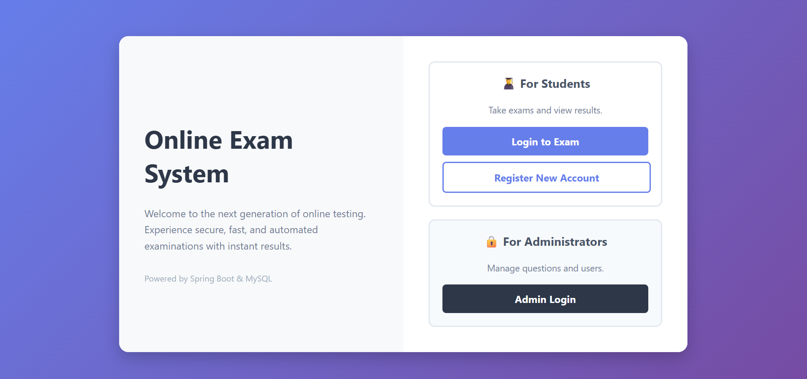
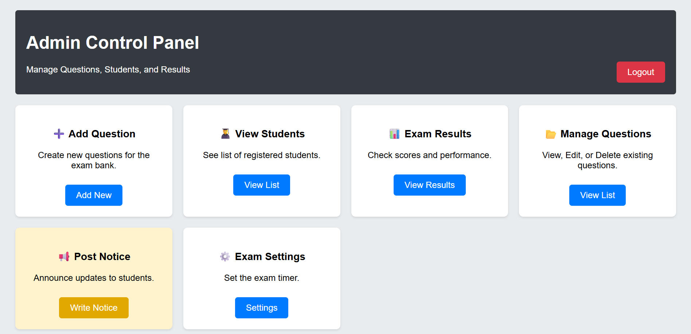
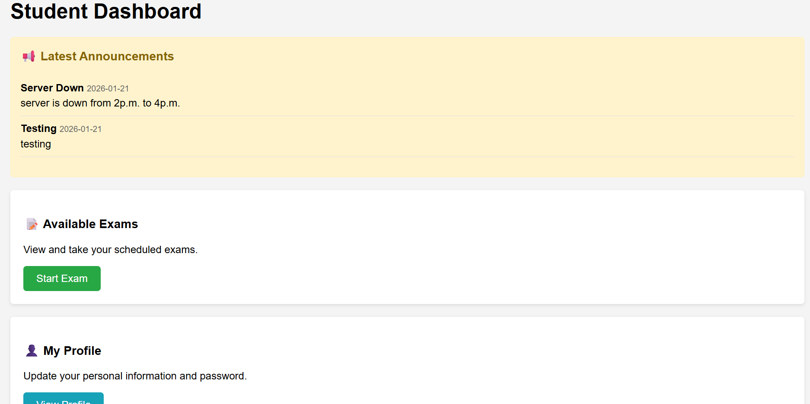
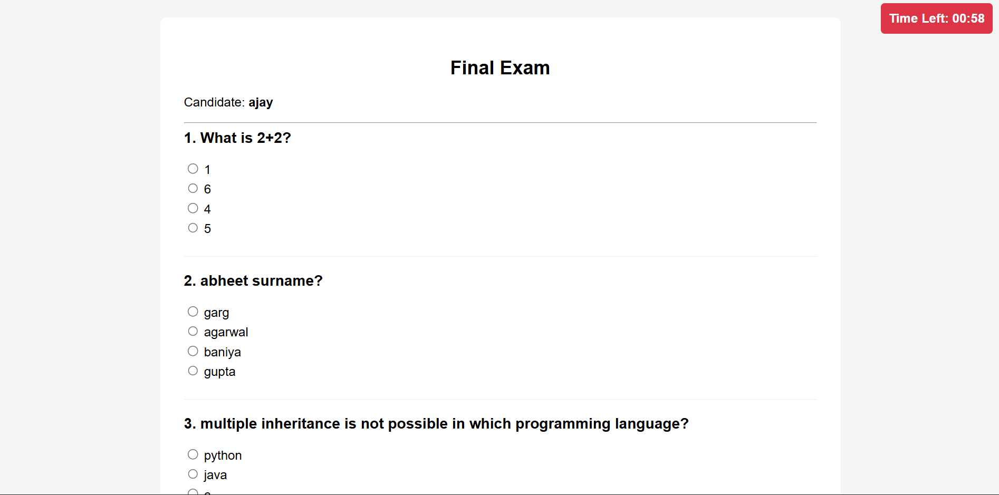
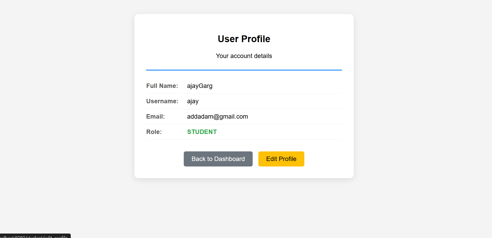

# 📝 Online Examination System

## 📌 Project Overview
The **Online Examination System** is a web-based application developed to automate and streamline the examination process.

This system replaces traditional paper-based exams with a secure digital platform for conducting assessments efficiently.

### 🚀 Expected Outcomes
- Improved examination management system  
- Faster and more accurate grading  
- Reduced administrative workload  
- Cost savings compared to traditional methods  
- Enhanced transparency and accessibility  

---

## 🎯 Project Objectives

The primary objectives of this project are:

- Analyse the requirements and limitations of the current examination system  
- Design and develop an efficient digital solution  
- Implement the solution in structured development phases  
- Test and evaluate system performance  
- Refine the system based on feedback  
- Deliver the project within the defined timeline  

---

## 🔍 Project Scope

The scope of this project includes:

- Conducting literature surveys to study existing systems  
- Performing requirement analysis to identify user needs  
- Designing system architecture and modules  
- Implementing the system based on approved design  
- Testing and validating system performance  
- Preparing complete documentation and final deliverables  

---

## ⚙️ Project Modules & Development Phases

The project is divided into five key modules:

---

### 1️⃣ Requirement Analysis

**Objective:**  
Gather and analyse system requirements to meet stakeholder and end-user needs.

**Key Tasks:**
- Stakeholder interviews  
- Technology review  
- Functional requirements documentation  
- Non-functional requirements documentation  

**Deliverable:**  
Requirement Analysis Document  

---

### 2️⃣ System Design

**Objective:**  
Design system architecture and modules based on approved requirements.

**Key Tasks:**
- Flow diagrams  
- Database schema design  
- UI/UX design  
- Module breakdown  

**Deliverable:**  
System Design Document  

---

### 3️⃣ Implementation

**Objective:**  
Develop the system according to the approved design.

**Key Tasks:**
- Coding individual modules  
- System integration  
- Unit testing  
- Debugging  

**Deliverable:**  
Working Prototype  

---

### 4️⃣ Testing & Evaluation

**Objective:**  
Ensure the system meets all functional and performance requirements.

**Key Tasks:**
- System testing  
- User Acceptance Testing (UAT)  
- Bug fixing  
- Performance evaluation  

**Deliverable:**  
Test Report & Performance Evaluation Document  

---

### 5️⃣ Documentation & Final Report

**Objective:**  
Compile and present complete project documentation.

**Key Tasks:**
- Detailed system documentation  
- Implementation details  
- User manual preparation  
- Final report submission  

**Deliverable:**  
Final Project Report & User Manual  

---
# 📸 Screenshots

## 🏠 Landing Page

---

## 🛠 Admin Control Panel

---

## 🎓 Student Dashboard

---

## 📝 Examination Platform

---

## 👤 Student Profile Page

---

## 🛠️ Technology Stack

- Frontend: HTML, CSS, JavaScript  
- Backend: Java, Spring Boot 
- Database: MySQL  
- Tools: Git, GitHub, Eclipse  

---

## 📈 Future Enhancements

- AI-based proctoring  
- Automated result analytics  
- Integration with LMS platforms  
- Mobile application support  

---

